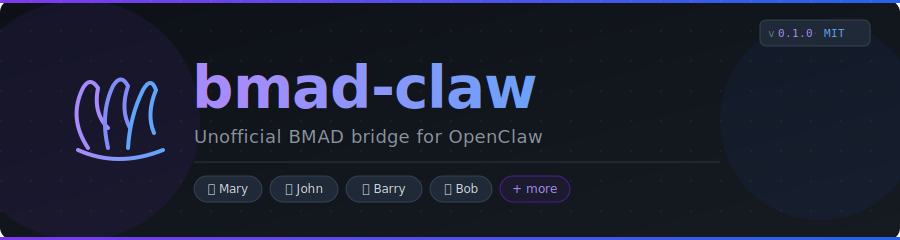

<div align="center">
  

  <br />

  
  
  
  

  <br />

  **Bring BMAD agents (Mary, John, Barry, and more) to life as real, persistent OpenClaw agents.**  
  Freestyle-first personality. Workflows on demand. One-step setup.

  <br />

  > **Unofficial.** Not affiliated with [bmad-code-org](https://github.com/bmad-code-org).  
  > BMAD-METHOD is MIT licensed. This plugin does not bundle BMAD content.

</div>

---

## What Is This?

`bmad-claw` is an OpenClaw plugin that bridges **[BMAD-METHOD](https://github.com/bmad-code-org/BMAD-METHOD)** — an AI-driven agile development framework — with **OpenClaw**, a persistent AI agent runtime.

Without this plugin, BMAD agents live only as one-shot Claude Code skills. With it, **Mary, John, Barry, and the rest become real OpenClaw agents**: persistent identity, session memory, project-local BMAD context, and full workflow access — all while keeping their personality front and center.

---

## Features

| | |
|--|--|
| 🧠 **Persona-first agents** | Each BMAD agent gets a handcrafted `SOUL.md` — character, communication style, principles. No menus until you ask. |
| 📂 **BMAD-aware sessions** | Hook injects the module version banner when you're working inside a BMAD project directory. |
| 🔧 **Workflow on demand** | Ask Mary for market research, John for a PRD — the `bmad_workflow` tool resolves it by code or name. |
| 🌐 **Works without BMAD** | Agents load from a committed fallback snapshot. Full persona, no workflows until BMAD is installed. |
| 🚀 **One-step setup** | `openclaw plugins install @sphinxcode/bmad-claw` → multiselect → done. |
| 🔄 **Drift detection** | `openclaw bmad sync` re-checks each agent against the live manifest and regenerates only what changed. |
| 📦 **Fallback snapshot** | Bundled `agents.json` + `workflows-catalog.json` — no BMAD repo needed to install. |

---

## Prerequisites

- [OpenClaw](https://openclaw.dev) `>= 2026.3.24-beta.2`
- Node.js `>= 20`
- [BMAD-METHOD](https://github.com/bmad-code-org/BMAD-METHOD) *(optional — agents work without it in persona-only mode)*

---

## Quick Start

### 1 — Install the plugin

```sh
openclaw plugins install @sphinxcode/bmad-claw
```

The postinstall script runs `openclaw bmad install` automatically. You'll see a multiselect:

```
  1. ◉ Mary          Business Analyst        (bmm)
  2. ◉ John          Product Manager         (bmm)
  3. ◉ Barry         Solution Architect      (bmm)
  4. ◉ Bob           Scrum Master            (bmm)
  ...
Press Enter to install selected (default), or type numbers to toggle:
```

BMM + TEA agents are pre-selected. CIS is opt-in. Press **Enter** to accept.

### 2 — Start a session with Mary

```sh
openclaw agent mary
```

She introduces herself. No menus. Just conversation.

### 3 — Ask for a workflow

```
You: Can you do a competitive analysis for us?
Mary: On it. Let me pull up the market analysis workflow.
      [invokes bmad_workflow → bmad-market-research skill]
```

---

## CLI Commands

```sh
openclaw bmad install          # Set up agents (multiselect, idempotent)
openclaw bmad install-bmad     # Install BMAD-METHOD if you don't have it yet
openclaw bmad sync             # Re-check agents for persona drift, regenerate if changed
openclaw bmad status           # Show BMAD home, mode, bound agents, skill count
openclaw bmad config set-home  # Manually set BMAD install path
```

---

## How It Works

```
openclaw.json                     ~/.openclaw/
├── agents.list                   ├── identity/bmad/<agentId>/
│   └── { id, workspace, ... }   │   ├── SOUL.md          ← persona source
│                                 │   ├── AGENTS.md        ← behavior rules
plugins.entries.bmad-claw         │   └── .source.json     ← drift hash
└── config                        └── workspace-<agentId>/
    ├── bmadHome                      ├── SOUL.md          ← loaded by OpenClaw
    ├── boundAgents                   └── AGENTS.md
    └── defaultMode
```

**Detection chain:** stored `bmadHome` config → `cwd/_bmad` → `~/.openclaw/_bmad`

**Two modes:**

| Mode | Condition | Agents | Workflows |
|------|-----------|--------|-----------|
| `full` | `_bmad/_config/manifest.yaml` found | Live manifest | Live `module-help.csv` |
| `persona-only` | No BMAD detected | Bundled snapshot | None (install guide offered) |

---

## Agents Included

> Loaded from your live BMAD install, or from the bundled fallback snapshot.

| Agent | Role | Module |
|-------|------|--------|
| 📊 **Mary** | Business Analyst | BMM |
| 📋 **John** | Product Manager | BMM |
| 🏗 **Barry** | Solution Architect | BMM |
| 🧠 **Bob** | Scrum Master | BMM |
| 🛡 **Winston** | Security Engineer | BMM |
| ✈ **Amelia** | DevOps Engineer | BMM |
| 🧪 **Quinn** | QA Engineer | BMM |
| 📝 **Sally** | Technical Writer | BMM |
| 🎨 **Paige** | UI/UX Designer | BMM |
| 📊 **Murat** | Data Analyst | BMM |

---

## Installing BMAD

If BMAD-METHOD isn't installed yet, agents will offer to walk you through it. Or run it yourself:

```sh
openclaw bmad install-bmad
```

You'll be asked two questions:

```
Include Game Development (GDS)? [Y/n]
Include Creative Intelligence (CIS)? [Y/n]
```

Core modules (BMM + BMB + TEA) install automatically. Answer N to both for a standard setup.

---

## Refreshing the Fallback Snapshot

The `assets/fallback/` directory is a committed snapshot of BMAD personas and workflows. To refresh it from a local BMAD-METHOD clone:

```sh
npm run snapshot
# or with a custom path:
node scripts/snapshot-bmad.mjs --bmad-repo /path/to/BMAD-METHOD
```

Commit the updated `assets/fallback/` files.

---

## Development

```sh
npm run build     # TypeScript check (zero errors expected)
npm test          # Run test suite
npm run snapshot  # Regenerate fallback assets
```

---

## Attribution

**BMAD-METHOD** is created and maintained by [bmad-code-org](https://github.com/bmad-code-org) and is MIT licensed.

`bmad-claw` is an independent, unofficial plugin. It reads BMAD's published CSV interface (`agent-manifest.csv`, `manifest.yaml`, `module-help.csv`) and does not modify or bundle BMAD content.

---

## License

MIT © sphinx-codes

---

<div align="center">
  <sub>Built with <a href="https://openclaw.dev">OpenClaw</a> · Powered by <a href="https://github.com/bmad-code-org/BMAD-METHOD">BMAD-METHOD</a></sub>
</div>
